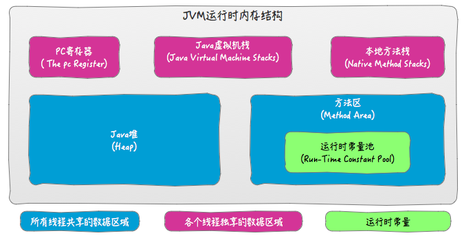
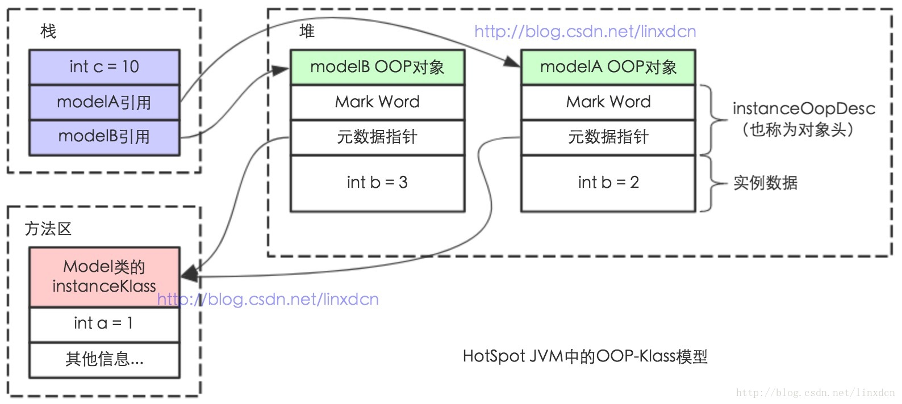

# JVM

### JVM内存结构

​	下图中标注颜色的区域只是JVM规范中定义的逻辑区域，虚拟机实现的实际物理区域与逻辑区域并不完全对应。

​	除以上区域外，还存在不由JVM管理的，本地方法库直接在堆外申请的内存区域，也叫**直接内存**。

​	

### Java内存模型（Java Memory Model，JMM）

​	定义了共享内存系统中当多线程读写数据的规范，保证共享内存的正确性（可见性，原子性，有序性）。

​	JMM中所有变量存储在主存中，每条线程的工作内存中保存了该线程中需要用到的变量在主寸中的拷贝。线程只能操作自己工作内存中的数据，不能直接读写主存，不同线程间工作内存也不能相互访问，线程间数据的传递需要工作内存与主存之间进行数据同步。

​	JMM除了定义以上描述的规范外，还提供了一系列封装了底层实现的关键字，如volatile，synchronized，final，concurren包等。

### Java对象模型（Java对象自身的存储模型）

​	HotSpot虚拟机中，设计了一个OOP-Klass Model。OOP（Ordinary Object Pointer）指的是普通对象指针，而Klass用来描述对象实例的具体类型。

### 常量池

* 代码中的字符串字面值，通过字符串常量池（JVM唯一）与运行时常量池（class唯一）共享。所以代码中重复出现的相同字符串字面值，实际是同一个堆上的对象。

https://blog.csdn.net/qq_26222859/article/details/73135660

### gc算法

| gc算法                            | 使用场景           |
| --------------------------------- | ------------------ |
| serial+serial old                 | client 模式        |
| parNew + CMS + serial old         | service模式        |
| parallel Scanvange + parallel old | 提高吞吐量，对响应 |
| G1                                | 对CMS的upgrade     |

* java内存模型
* 类加载过程
* JVM 新生代与老年代默认比例为1:2， **–XX:NewRatio**设置年老代与年轻代大小的比值
* JVM中年轻代中Eden与两个Survivor默认比例为8:1:1，**-XX:SurvivorRatio**设置Eden与一个Survivor区大小的比值。
* -Xms -Xmx -Xmn -Xss 
* -XX:PermSize -XX:MaxPermSize 
* -XX:MetaspaceSize -XX:MaxMetaspaceSize