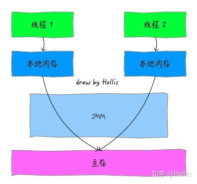

## JAVA内存模型（JMM）

所有线程共享的变量都储存在主内存中（可类比为物理硬件的主内存）

每个线程有自己的工作内存（可类比为物理硬件的CPU高速缓存）

工作内存中保存了该线程使用到的变量的主内存副本拷贝。

线程对变量的所有操作都必须对工作内存进行，不能直接操作主内存。




### 8种原子内存操作

JMM定义了8种原子内存操作：

- lock（锁定）：作用于主内存，标识为线程独占。并清空此变量在工作内存中的值，重新从主内存读取。
- unlock（解锁）：lock的反操作。执行此操作前，必须将此变量同步回主内存。
- read（读取）：作用于主内存，将变量的值从主内存传输到工作内存。
- load（载入）：作用于工作内存，将read操作获取的值放置在工作内存的变量副本。
- use（使用）：作用于工作内存，将工作内存的值传给执行引擎。
- assign（赋值）：作用于工作内存，将从执行引擎接收到的值赋值给工作内存的变量。
- store（存储）：作用于工作内存，将变量的值从工作内存传输到主内存。
- write（写入）：作用于主内存，将store操作获取的值放置在主内存的变量。


### 原子性

当多个原子操作组合在一起时，不能保证其原子性。

```java
volatile int a=0;
// thread1
a++;
// thread2
a++;
```

解决原子性问题的方法：

- 互斥同步，synchronized，JUC下的Lock接口实现等。互斥的线程不能同时运行，就无所谓是否原子性了。
- 非阻塞同步：CAS（compare and swap）硬件层面提供的原子性操作，配合失败重试，保障最终结果正确。


### 有序性

在保障单线程的最终结果一致的前提下，实际执行时会进行优化，即指令重排序。

```java
// 典型的DCL单例实现，请问如下代码有问题嘛？
class A{
    private A(){}
    
    private static A a=null;
    
    public static A getInstance(){
        if(a==null){
            synchronized(A.class){
                if(a==null){
                    a=new A();
                }
            }
        }
        return a;
    }
}
```

解决有序性问题的办法：

- 互斥同步。互斥的线程不能同时运行，其他线程只能在当前运行线程执行完毕后才能观察共享变量，所以不会观察到处理到一半的变量。
- volatile禁止指令重排序。通过加入内存屏障，保证代码中的操作相对于内存屏障位置不变。


### 可见性

变量的写操作，不会实时更新到主内存；变量的读操作，也不会实时从主内存中读取。当并发线程有共享变量时，需要额外的手段保证共享变量的可见性。

保证可见性的方法：

- volatile变量
- synchronized锁对象
- final变量
- happens-before原则


### happens-before原则

JMM定义的一些两项操作之间的偏序关系，实际上是可见性保证规则：

- Program Order Rule
- Monitor Lock Rule。**synchronized代码块中的共享变量操作可见性依赖于此。**
- Volatile Variable Rule。**JUC下的并发工具类依赖于此才保障可见性。**
- Thread Start Rule
- Thread Termination Rule
- Thread Interruption Rule
- Finalizer Rule
- Transitivity(传递性)

以Monitor Lock Rule为例，通俗一点的解释是：

同一个锁对象，先执行的synchronized代码块中对共享变量的操作，对后执行的synchronized代码块可见。


## 保障并发安全

### 避免共享内存，保障并发安全

- 只依赖于方法参数与局部变量。
- 线程本地存储，使用threadLocal类实现。


### volatile

- 保障volatile变量可见性，以及根据volatile Variable Rule保障其他共享变量可见性。
- 限制指令重排序

常见于搭配CAS使用，比如Atomic类，依赖于volatile变量可见性获得最新的值。

JUC下的同步工具类，都依赖于volatile Variable Rule保障其他共享变量的可见性。

DCL单例实现时，依赖与volatile变量限制指令重排序。


### synchronized

互斥同步方式避免原子性与有序性问题，锁对象与Monitor Lock Rule保障可见性。
	
最初版本的synchronized实现性能不好，后来做了很多优化改善性能问题，包括：自旋锁与自适应自旋锁，锁粗化，锁消除，偏向锁，轻量级锁，以及最坏情况的重量级锁。
	
目前来看性能基本与ReentrantLock一致。但是不如ReentrantLock灵活。推荐优先选择使用synchronized，因为语法简单，不容易出错。

```java
class A{
    // 锁对象是A.class类对象
    public static synchronized void b(){
        // do something
    }
    // 锁对象是实例对象
    public synchronized void c(){
        // do something
    }
    
    // 锁对象是lock对象
    private Object lock=new Object();
    public void d(){
        synchronized(lock){
            // do something
        }
    }
}
```


### ReentrantLock

实现的功能与synchronized一致，但是比synchronized更灵活。

```java
class A{
    private Lock lock=new ReentrantLock();
    public void b(){
        lock.lock();
        try{
            // do something
        } finally{
            lock.unlock();
        }
    }
}
```

ReentrantLock相比synchronized优点：

- tryLock方法可实现尝试获取，等待获取。
- synchronized是非公平锁，ReentrantLock可选择公平或不公平锁。
- 提供lockInterruptibly()方法，等待获取锁可中断
- synchronized只能支持单条件协作，ReentrantLock可以创建多个条件。


### ReentrantReadWriteLock

允许多个读操作并发进行；写操作时，读操作与其他写操作等待。

```java
class MyList{
    private List<String> list=new ArrayList();
    
    private final ReentrantReadWriteLock rwl = new ReentrantReadWriteLock();
    private final Lock r = rwl.readLock();    //读锁
    private final Lock w = rwl.writeLock();    //写锁
    
    public void add(String s){
        w.lock();
        try{
            list.add(s);
        }finally{
            w.unlock();
        }
    }
    
    public void get(int index){
        r.lock();
        try{
            list.get(index);
        }finally{
            r.unlock();
        }
    }
}
```


## 线程协作

当条件未满足时，让线程等待；条件满足后，线程被唤醒继续执行。


### synchronized

```java
Queue<String> queue = new LinkedList<>();

// 将如下代码放在循环中，启动多个消费者线程
new Thread(() -> {
    try {
        synchronized (queue) {
            while (queue.isEmpty()) {
                queue.wait();
            }
            String s = queue.poll();
            queue.notifyAll();
        }
    } catch (InterruptedException e) {
        e.printStackTrace();
    }
}).start();

// 将如下代码放在循环中，启动多个生产者线程
new Thread(() -> {
    try {
        synchronized (queue) {
            while (queue.size() >= 10) {
                queue.wait();
            }
            queue.offer("");
            queue.notifyAll();
        }
    } catch (InterruptedException e) {
        e.printStackTrace();
    }
}).start();
```


### Lock接口的实现类

```java
Queue<String> queue = new LinkedList<>();

Lock lock = new ReentrantLock();
Condition productCondition = lock.newCondition();
Condition customCondition = lock.newCondition();

// 将如下代码放在循环中，启动多个消费者线程
new Thread(() -> {
    lock.lock();
    try {
        while (queue.isEmpty()) {
            customCondition.await();
        }
        String s = queue.poll();
        productCondition.notifyAll();
    } catch (InterruptedException e) {
        e.printStackTrace();
    } finally {
        lock.unlock();
    }
}).start();

// 将如下代码放在循环中，启动多个生产者线程
new Thread(() -> {
    lock.lock();
    try {
        while (queue.size() >= 10) {
            productCondition.await();
        }
        queue.offer("");
        customCondition.notifyAll();
    } catch (InterruptedException e) {
        e.printStackTrace();
    } finally {
        lock.unlock();
    }
}).start();
```


### CountDownLatch

```java
CountDownLatch latch = new CountDownLatch(5);

// 将如下代码放在循环中，启动多个线程
new Thread(() -> {
    // do something
    latch.countDown();
}).start();

try {
    latch.await();
} catch (InterruptedException e) {
    e.printStackTrace();
}
```


### Semaphore

```java
Semaphore semaphore = new Semaphore(5);

// 将如下代码放在循环中，启动多个线程
new Thread(() -> {
    try {
        // 获取资源，重载方法可以获取多个资源
        semaphore.acquire();
        // do something
        // 释放资源，重载方法可以释放多个资源
        semaphore.release();
    } catch (InterruptedException e) {
        e.printStackTrace();
    }
}).start();
```


### CyclicBarrier

```java
CyclicBarrier cyclicBarrier = new CyclicBarrier(4);

for (int index = 0; index < 4; index++) {
    new Thread(() -> {
        try {
            // do something（吃鸡四人队集合，集合完毕才开始游戏）
            cyclicBarrier.await();
            // do something（各种搜房子，舔装备。然后挂了）
            cyclicBarrier.await();
            // do something（退出游戏）
        } catch (InterruptedException e) {
            e.printStackTrace();
        } catch (BrokenBarrierException e) {
            e.printStackTrace();
        }
    }).start();
}
```


### Phaser

提供比CyclicBarrier功能更丰富的线程同步工具类。


### Exchanger

```
Exchanger exchanger = new Exchanger();

new Thread(() -> {
    try {
        String s;
        // do something
        s = "wait to exchange";
        // 交换一下
        s = (String) exchanger.exchange(s);
    } catch (InterruptedException e) {
        e.printStackTrace();
    }
}).start();

new Thread(() -> {
    try {
        String s;
        // do something
        s = "wait to exchange";
        // 交换一下
        s = (String) exchanger.exchange(s);
    } catch (InterruptedException e) {
        e.printStackTrace();
    }
}).start();
```


### FutureTask

get方法会阻塞当前线程，等待FutureTask运行完毕后，唤醒当前线程，拿到执行结果。


### AQS（AbstractQueuedSynchronizer）

Lock的实现类，CountDownLatch，Semaphore，CyclicBarrier都是基于AQS实现的。我们可以基于AQS实现自己的同步工具类。

AQS中维护了一个volatile int表示资源量，一个线程等待队列。当资源不满足时，将线程放入等待队列并休眠；资源条件改变后，唤醒等待线程重新尝试获取资源。


## 并发安全容器

### Collections.synchronizedList(List<T> list)

包装模式，将非线程安全的list每个操作方法在包装类中用synchronized加锁实现并发安全。

### CopyOnWriteArrayList

写时复制。读线程共享，每个写线程在本线程独有的拷贝上完成写入。

### CopyOnWriteArraySet

基于CopyOnWriteArrayList实现。

### ConcurrentSkipListSet

跳表实现的并发安全有序Set

### ConcurrentHashMap

分段锁实现的细粒度加锁，提升并发性能。

### ConcurrentSkipListMap

跳表实现的并发安全有序Map

### ConcurrentLinkedQueue

非阻塞方式实现的基于链表的无界线程安全队列，性能很好

### ArrayBlockingQueue

基于数组实现的有界阻塞队列

### LinkedBlockingQueue

基于链表实现的有界阻塞队列

### PriorityBlockingQueue

非阻塞方式实现的基于链表的无界线程安全队列，性能很好

### DelayQueue

延时获取元素的无界阻塞队列

### SynchronousQueue

此队列不存储任何元素，每个put操作必须

### ArrayDeque

基于数组的双向非阻塞队列

### LinkedBlockingDeque

基于链表的双向阻塞队列
