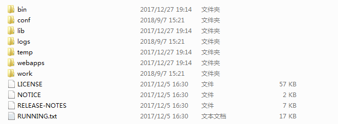
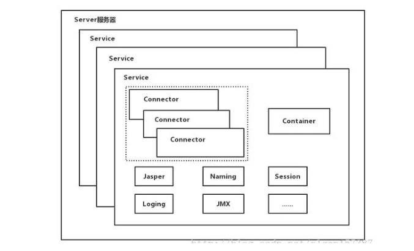
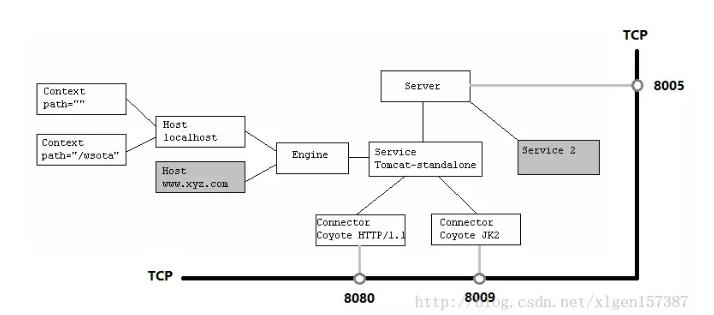
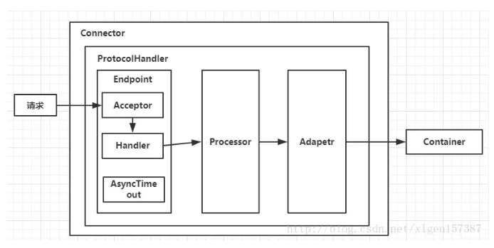
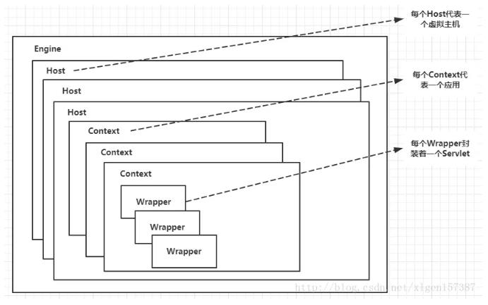

# Tomcat

[tomcat教程](https://mp.weixin.qq.com/s/-b7x-2yV51iN4_zpNiYhBg)

[tomcat教程](https://mp.weixin.qq.com/s/BVA66_mInha4AV6hVNaxgw)

## tomcat项目结构

-   **/bin** 命令文件。.sh后缀为linux命令，.bat结尾为windows命令
-   **/conf** 配置文件。
-   **/lib** 运行所需的jar包。
-   **/logs** 运行日志。
-   **/temp** 运行过程中生成的临时文件。
-   **/webapps** 待发布的应用程序。
-   **/work** 运行时生成的编译后文件。如JSP编译后文件

## Tomcat Framework

## Connector Framework

## Container Framework

